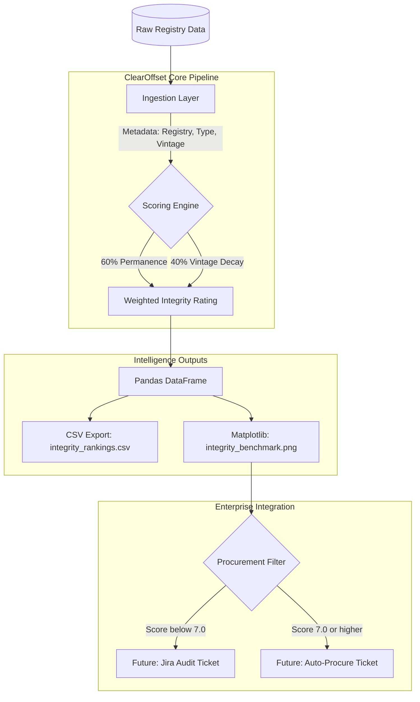

# ClearOffset: Carbon Credit Integrity Scraper 🌍

ClearOffset is a Python-based decision-support tool designed to evaluate the **integrity** of voluntary carbon market (VCM) projects. By applying a weighted scoring algorithm aligned with GHG Protocol principles, it helps corporate buyers identify high-quality offsets and mitigate greenwashing risk.

---

## Strategic Value: Mitigating Greenwashing via Quantitative Integrity Auditing

In a maturing carbon market, **additionality** and **permanence** are the primary currencies of trust.

- **Integrity Evaluation:** Uses quantitative thresholds to distinguish high-integrity removals (e.g., geologic storage) from lower-integrity offsets (e.g., legacy renewables).
- **Risk Mitigation:** Flags projects that no longer meet modern corporate climate standards.
- **Strategic Procurement:** Directs capital toward high-impact technical removals by assigning higher scores to long-duration (1,000+ year) storage.

---

## Tech Stack

- **Language:** Python 3.10+
- **Data Science:** Pandas (data manipulation), Matplotlib (visualization)
- **Security:** python-dotenv (environment variable management)
- **Infrastructure:** Modular, API-ready framework (Requests)

---

## Core Capabilities

- **High vs. Low Integrity Differentiation:** Identifies high-integrity removals (DAC, mineralization) vs. lower-integrity offsets (forestry, legacy renewables).
- **Weighted Scoring Algorithm:**  
  - 60% permanence (technical vs. biological storage)  
  - 40% vintage decay
- **Additionality Filter:** Applies penalties to credits older than 5 years to reflect evolving baselines.
- **Visual Benchmarking:** Generates color-coded analysis (`integrity_benchmark.png`) for stakeholder reporting.

---

## System Architecture

The tool follows a structured pipeline to transform raw registry data into actionable ESG intelligence.



---
## Pipeline Overview

1. **Ingestion**  
   Fetches project metadata (registry, type, vintage).

2. **Scoring Engine**  
   Applies weighted logic to evaluate the integrity gap across project types.

3. **Visualization**  
   Generates benchmarking charts for quick comparison.

4. **Integration (Future)**  
   Designed for Jira Service Management integration to automate procurement and audit workflows.

---

## Repository Structure

```bash
ClearOffset/
├── .env                      # Private API keys (local only)
├── .gitignore                # Prevents sensitive data leaks
├── requirements.txt          # Project dependencies
├── scraper.py                # Main execution & visualization logic
├── utils/
│   └── scoring_logic.py      # Weighted scoring algorithm
├── data/
│   ├── integrity_rankings.csv
│   └── integrity_benchmark.png
└── README.md
```

---
## Credential Security & Environment Configuration

This project follows best practices for secure configuration management:

- **Environment Isolation:** Sensitive values stored in `.env`
- **Leak Prevention:** `.gitignore` prevents credential exposure
- **Runtime Injection:** Uses `load_dotenv()` to avoid hardcoding secrets

---
## Future Roadmap

- **Jira Integration:** Automated ticket creation for projects scoring below threshold (7.0)
- **Advanced Visualizations:** Bubble chart mapping Vintage (X), Integrity (Y), and Volume (size)
- **Live Registry Sync:** REST client integration with Carbonmark API for real-time data
